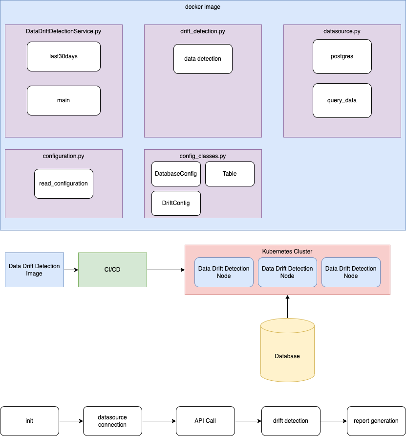

# DataDriftDetectionService
The Data Drift Detection Service analyzes data to spot potential drifts in the data used for machine learning models.
The system generates a report with interactive graphs. The system runs based on the API calls made to it.
The system can be converted to a running process and combined with a cron job to generate reports periodically. 
The system uses Evidently, an opensource data drift detection library, to analyze the data and generate the reports.

## Architecture

## Deployment Strategies
Current deployment Strategies involve creating separate deployments for the different types of reports required from the system.
The system can currently be configured for 5 different types of reports:
- DataQualityPreset
- DataDriftPreset (Default)
- TargetDriftPreset
- RegressionPerformancePreset
- ClassificationPerformancePreset

## Getting Started
In order to test out the system. Modify the datadriftconfig.yaml file to specify the database host, tables, and columns you want to analyze.
If you don't have a database, you can use the database that is started with the docker-compose.yaml file. 
You will have to update the tables and columns section to whatever test data you load into the test database. 
To create a docker image build the image with the command `docker build . --no-cache -t datadriftdetectionservice:1.0.3`
Then one can simply run `docker-compose -f docker-compose.yaml up -d` to start the service and database. The docker-compose file is pre-configured for the database.

## Future Enhancements

- Modification to Configuration Yaml to allow for multiple reports creation for the same dataset. 
- Modification to Configuration Yaml and Code to allow for custom parameters and thresholds for Report Presets 
- Notification system to alert when data drift happens or emails out reports to selected individuals
- Integration of Sample Size Configuration
- Separate process for interacting with Kafka for event based monitoring for data drift

### Developed By:
- Scott Poulin @ Improving